# Bad Apple Loss Landscape

Every frame of *Bad Apple!!* rendered as a loss landscape over the **first hidden layer** of a small (5-layer) convolutional network, inspired by [Welch Lab's](https://www.youtube.com/@WelchLabs) videos on [AlexNet](https://youtu.be/UZDiGooFs54), [ResNet](https://youtu.be/QgH9sr7G13Q) and their really really nice visualizations.

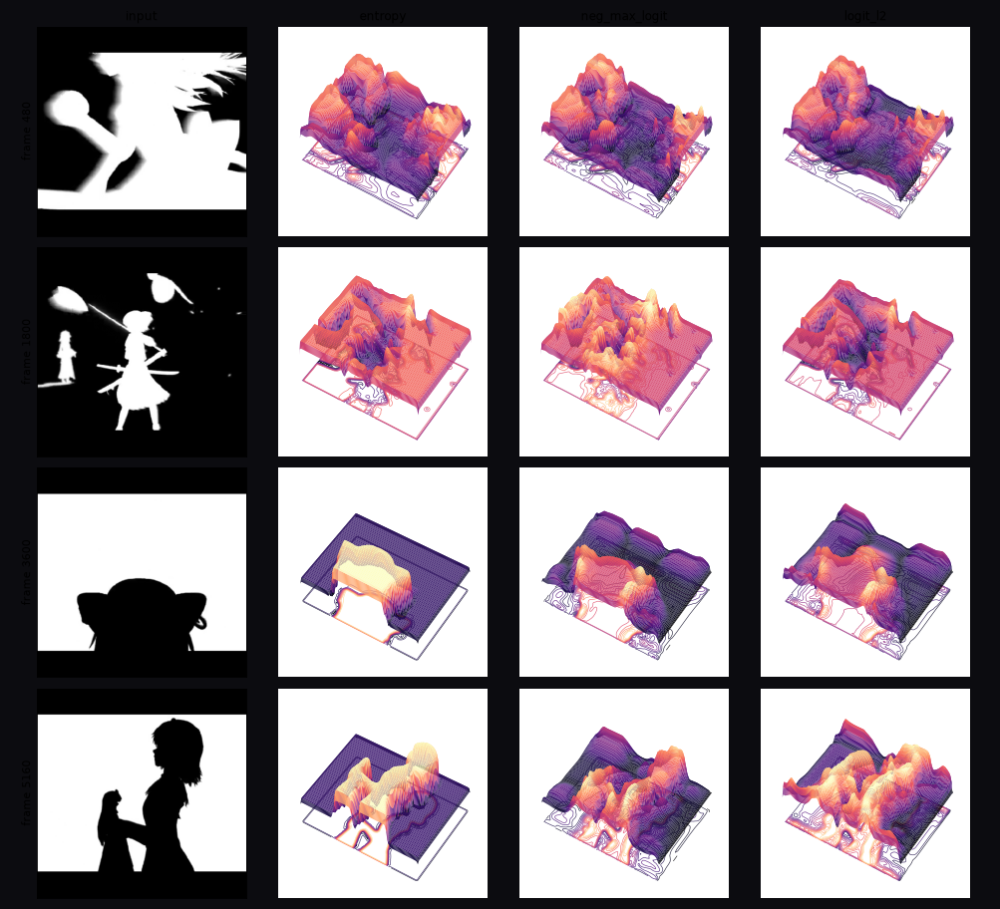

Source frame -> same frame as a loss surface under 3 categories of loss definitions: **entropy**, **neg_max_logit** and **logit_l2** 
## 1. placeholder (demo)

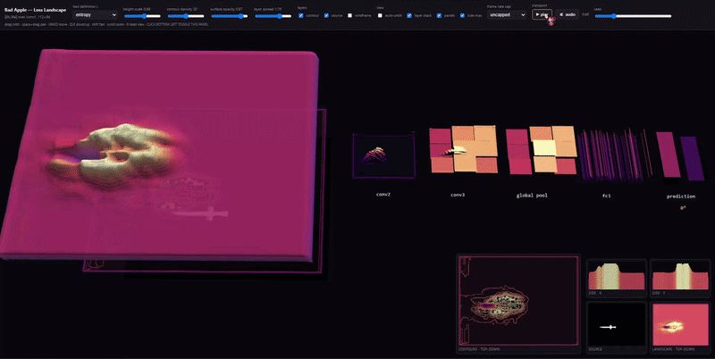

wip

## 2. Approach (determining height)

For frame `x`, let `a = conv1(x)` be the first hidden layer, pre-ReLU. 

The **height** at grid point `(i,j)` is the loss response to a localized perturbation of `a` there:


where `e_ij` perturbs all channels at spatial position `(i,j)`. The gradient form is the small-ε limit and costs **one backward pass per batch** instead of H×W forward passes, which is 9,408 times cheaper per frame.


`heights.finite_eps_probe` checks the two forms against each other.

Filter normalization carries from weight space to activation space as a per-channel scaling by that channel's activation norm:

```python
def _channel_scales(a, eps=1e-8):
    """Filter-norm analogue: channel c's perturbation is scaled by ||a_c||."""
    s = a.detach().flatten(2).norm(dim=2)              # (B,C)
    return s / (s.mean(1, keepdim=True) + eps)
```

The final surface blends two terms:

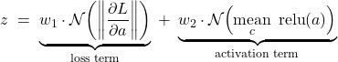


`w1` supplies ReLU-gated edges and ridges; `w2` supplies the silhouette. See **Section 6** to see what this implies.

## 3. Architecture


The architecture is based on AlexNet, a simple CNN classification model.
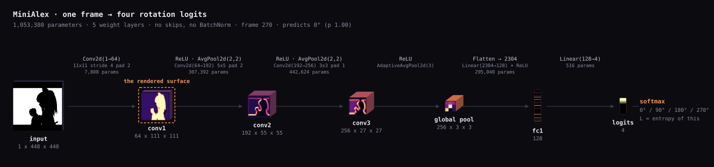


Input is letterboxed to 448×448 and mapped to [−1,1]. `conv1` mirrors AlexNet geometry — `Conv2d(1, 64, k=11, s=4, p=2)` → **111×111** — then a mini-AlexNet head. The heightmap is cropped to rows 14–98 (dropping the letterbox bars) and padded to width 112, giving a **112×84** 4:3 grid.

```python
class MiniAlex(nn.Module):
    def __init__(self, num_classes=4, width=64, logit_scale=4.0, gabor=True,
                 n_dc=16, pool="avg", seed=0):
        super().__init__()
        POOLS = {"avg":  lambda: nn.AvgPool2d(2, 2),     # we use this (see why in section 4)
                 "avg3": lambda: nn.AvgPool2d(3, 2),
                 "max":  lambda: nn.MaxPool2d(3, 2)} 
        P = POOLS[pool]
        
        self.conv1 = nn.Conv2d(1, width, kernel_size=11, stride=4, padding=2) # render
        self.head = nn.Sequential(
            nn.ReLU(inplace=True), P(),
            nn.Conv2d(width, 192, 5, padding=2), nn.ReLU(inplace=True), P(),
            nn.Conv2d(192, 256, 3, padding=1), nn.ReLU(inplace=True),
            nn.AdaptiveAvgPool2d(3), nn.Flatten(),
            nn.Linear(256 * 9, 128), nn.ReLU(inplace=True),
            nn.Linear(128, num_classes))

    def pre_relu(self, x):
        """THE RENDER (conv1 before ReLU and avgpool)"""
        return self.conv1(2.0 * x - 1.0)
```

`conv1` is initialized with a Gabor bank plus a DC-sensitive low-pass set rather than randomly (See 5.2 to see what this implies). 

---

## 4. Landmines and pitfalls

Every configuration below produces a pipeline that *runs cleanly* but renders something useless or misleading. 

Metrics on 411 frames spanning the clip.

`lattice` = FFT power near the Nyquist corner (checkerboard signature).


`flicker` = mean |z[t] − z[t−1]|. 

`corr_frame` = |corr| with the source frame.

### 4.1 Pooling (downsamples)

| pooling | nonzero | corr_frame | lattice ↓ | flicker ↓ | verdict |
|---|---|---|---|---|---|
| `MaxPool2d(3,2)` | 0.437 | 0.063 | **3.373** | 0.087 | sparse → renders as static |
| `AvgPool2d(3,2)` | 1.000 | 0.205 | **1.728** | 0.148 | overlapping → checkerboard lattice |
| `AvgPool2d(2,2)` | 0.991 | **0.279** | **0.245** | 0.129 | correct |

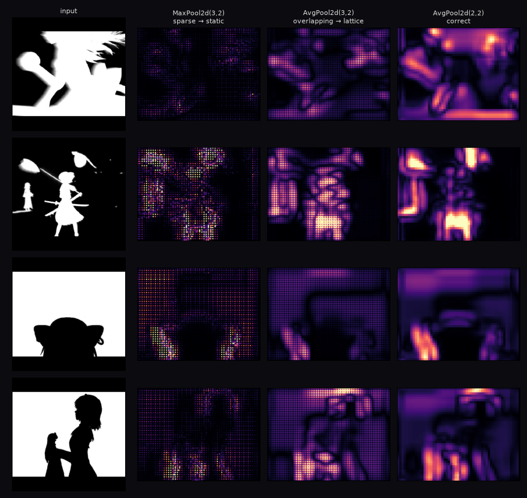

MaxPool routes gradient only to winning positions, so ~56% of the grid sits at exactly zero. The surviving values are isolated spikes — the surface is visual static, and `corr_frame` collapses to 0.063 (useless)

`AvgPool2d(3,2)` has **overlapping** windows at stride 2, so gradient coverage per input position is non-uniform in a period-2 pattern. That stamps a regular lattice across the heightmap — a 7× worse lattice score than non-overlapping — which shimmers under animation. `AvgPool2d(2,2)` is the next obvious thing that fixes it.

### 4.2 conv1 (the first layer) must contain DC-sensitive filters


 Bad Apple is almost entirely flat interiors (b/w silhouettes), so a zero-mean filter convolved with a *constant* region returns exactly zero, regardless of the constant, resulting in **identical** (zero) response to flat white and flat black, and the silhouette interior is doomed.

Measured as mean |conv1 pre-ReLU| in eroded flat interiors, relative to at edges:

| conv1 bank | interior/edge (real video) |
|---|---|
| zero-mean Gabor only, `n_dc=0` | **0.021** |
| Gabor + DC low-pass, `n_dc=16` | **1.362** |

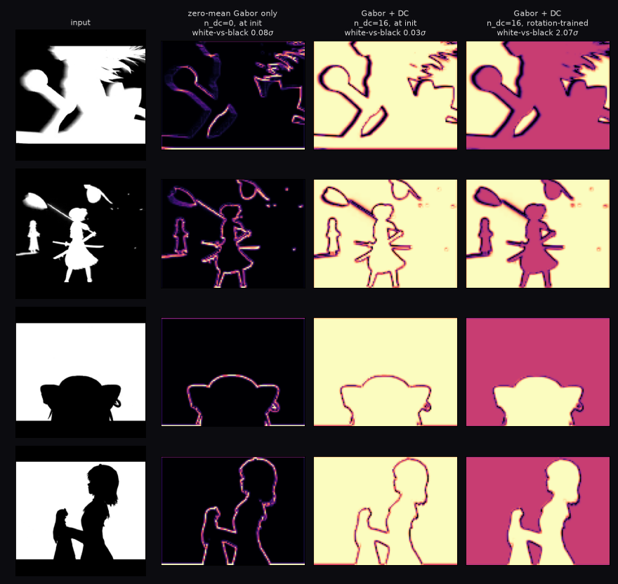

At `n_dc=0` interiors are ~50× quieter than edges: the map is a pure outline on black. 

With DC filters, interiors respond *more* strongly than edges.

### 4.3 The network has to have learned something

In other words, we have to *actually* train the model on something. Conv1 has to be pushed towards a certain direction.

A randomly initialized head produces `∂L/∂a` dominated by the head's own random structure rather than by image content, as seen in the figure below. 

`train.py` uses **rotation prediction**, ~94% accuracy on 4 classes.

| head | corr_frame (∇) | corr_edge | flicker ↓ |
|---|---|---|---|
| random init | 0.133 | 0.078 | 0.254 |
| rotation-trained | **0.278** | **0.251** | **0.134** |

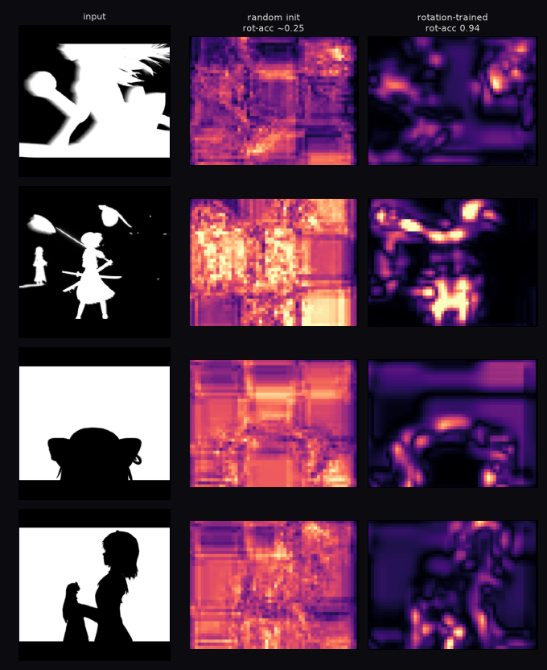

Training doubles correlation with the frame and cuts flicker by 41%.


### 4.4 The head must not global-pool straight after conv1

With GAP directly after conv1, `∂L/∂a[c,i,j] = (1/HW)·∂L/∂pooled_c` , which depends on the frame size, and has ZERO dependence on `(i,j)` at all. 

Spatial structure has to come from ReLU gating and the conv stack *between* conv1 and the pool.

| head | spatial CV of ‖∂L/∂a‖ |
|---|---|
| mini-AlexNet head (used) | **0.271** |
| GAP-after-conv1 | **0.026** |

Not exactly zero, because the ReLU before the pool leaks some structure through its gating mask, but effectively uniform, and the landscape is dead.

### 4.5 Normalization and temporal stability (flicker reduction)

| configuration | flicker ↓ |
|---|---|
| per-frame min-max | 0.0464 |
| global percentile | 0.0327 |
| global + blur σ=1.2 + EMA α=0.6 | **0.0164** |

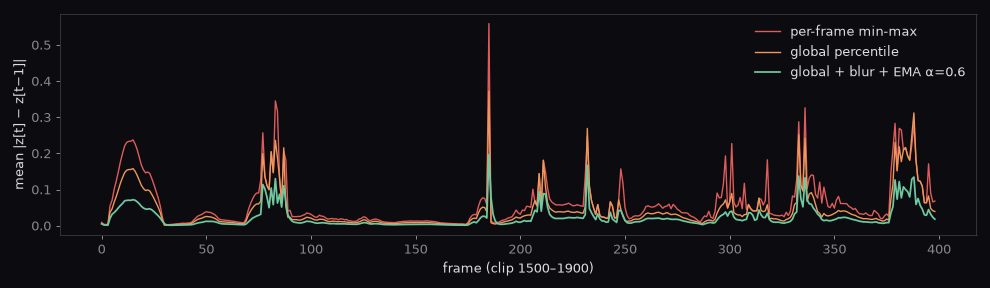

Per-frame min-max renormalizes to the frame's own extremes, so the terrain pump on every cut and quiet frames are amplified to full range.

---

## 5. The w1/w2 tradeoff

This is the one aesthetic (subjective) parameter, and it's basically a tug of war between the two things this project aims for: aesthetics and coherence (boring binary slab and incoherent mess).

| w2 | corr_frame (global) ↑ | reading |
|---|---|---|
| 0.0 | 0.22| pure loss term: beautiful, illegible |
| 0.35 | 0.352| ok |
| **1.0** | **0.796**| **default — best on all three** |
| 2.0 | 0.885 | more legible, flatter |
| 4.0 | **0.904** | binary slab |

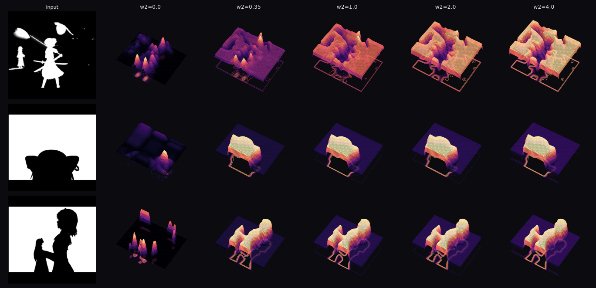


## 5 and a half. Training (part 2)

BUT, how much training do we have to do?

| steps | train acc | validation acc | corr_frame | separation | relief |
|---|---|---|---|---|---|
| 200 | 0.738 | 0.629 | 0.289 | 0.947σ | 0.0858 |
| 400 | 0.777 | 0.688 | 0.259 | 0.904σ | 0.0778 |
| 800 | 0.875 | 0.703 | 0.396 | 1.224σ | 0.0691 |
| 1600 | 0.902 | 0.656 | 0.512 | 1.610σ | 0.0570 |
| 3200 | 0.938 | 0.680 | 0.644 | 1.926σ | 0.0476 |


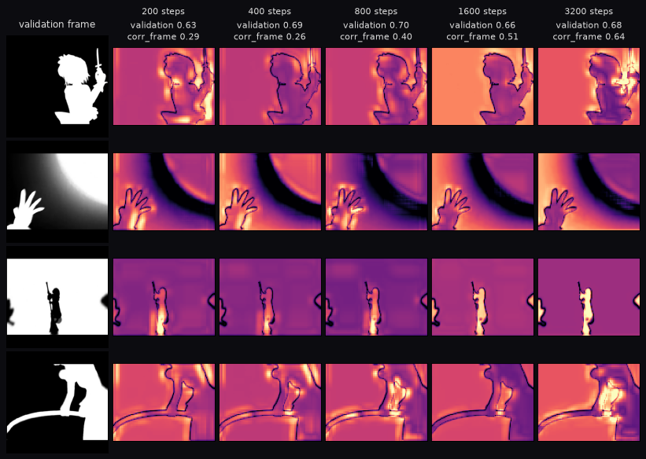

As you can see, the validation acc seems to flatten out very early on, but we keep training to optimize other stats, such as the correlation with the actual frame and separation between b/w regions.

We also do not want `corr_frame` to be close to 1, as that just means the output resembling a binary slab. See **section 5**.

These stats are further tuned with `w2`.

---

## 6. The loss definitions

`losses.py` implements seven. Visually there are three:

| family | members | look |
|---|---|---|
| softmax uncertainty | `entropy`, `self_ce`, `fixed_ce`, `margin` | near-identical |
| max logit | `neg_max_logit` | brighter, more spread |
| unnormalized magnitude | `free_energy`, `logit_l2` | most energy in flat regions |

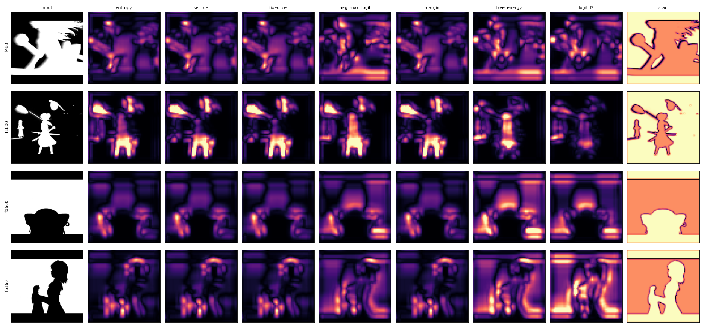

Those four are indistinguishable because with a confident model their gradients all point along the same top-1-vs-rest direction


**`entropy` is the default**: no labels required, and "how much does perturbing here change the model's uncertainty" is a clean thing to be plotting.

```python
def entropy(logits, **kw):
    logp = F.log_softmax(logits, -1)
    return -(logp.exp() * logp).sum(-1)
```

---

## 7. Rendering: the heightmap *is* a video

The heightmap stack is encoded as a **grayscale mp4** and used as a WebGL video texture driving vertex displacement.

```
Bad Apple → loss heightmaps → h264 → video texture → displaced mesh
```

123.7 MB of float16 becomes **~4 MB of h264**.

Verified round-trip fidelity and alignment:

| check | result |
|---|---|
| npy vs decoded mp4, lag 0 | **0.99975** |
| lag ±1 | 0.973 / 0.973 (sharp peak, no offset) |
| mean abs error | 0.0028 (≈0.7/255) |
| p99 / max error | 0.0128 / 0.0513 |

Two shader details that matter:

```glsl
// Vertex uv runs 0..1 across GW vertices, but texel centres sit at (i+0.5)/GW.
// Without this remap every sample is off by half a texel and the surface shears.
vec2 snap(vec2 uv){ return (uv * (res - 1.0) + 0.5) / res; }

// central differences -> analytic normal; far cheaper and smoother than
// recomputing geometry normals on the CPU every frame
float dx = (h(uv+vec2(t.x,0.0)) - h(uv-vec2(t.x,0.0))) * zScale;
float dy = (h(uv+vec2(0.0,t.y)) - h(uv-vec2(0.0,t.y))) * zScale;
vN = normalize(vec3(-dx/(2.0*step.x), -dy/(2.0*step.y), 1.0));
```

The viewer stacks three layers in 3 draw calls: the displaced surface, the
contour projection (the paper's signature 2D plot), and the source clip itself
beneath both. Surface opacity and layer spread are adjustable so the lower
layers read through the terrain. Five orthographic projections of the same
heightmap run alongside -- source frame, top-down shaded relief, top-down
contours, and side elevations along x and y. The side views collapse by max, so
they are literally the surface's silhouette seen from each axis.

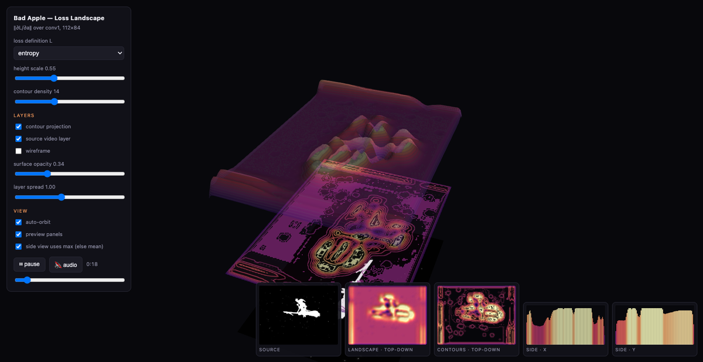


---


## 7.99999999999 Conclusion

Well, what we ended up with is an entirely conceptual model, trained to predict the rotation angle of Bad Apple frames. All of which are standing completely straight. So in conclusion, this model is entirely functionally useless, but the point of this project was to generate Bad Apple on a Loss Landscape, which I think this it succeeded in doing. 

The training existed solely for the purpose of "giving direction" to the first hidden layer, and a rotation classification task does surprisingly well at this. I initially had the idea of having the classification be somewhat meaningful by training the model to classify characters, but clustering ended up not giving sufficient direction to the layers at all (in the sense that the loss landscapes do not look like "Bad Apple"). Maybe in the future! However, I'm happy with this.

## 8. Installation/Running it

```bash
./setup.sh                 
source .venv/bin/activate

python generate.py --loss all      # train, then clip -> heightmaps    (~3 min)
# --steps N sets the training length (default 3200)

python generate_layers.py          # per-layer atlas for the viewer
python serve.py                    # open localhost:8766/viewer.html
```


Optional:

```
python blend.py --loss entropy --w2 1.0 # retune the blend
```


## 9. References

1. Li, Xu, Taylor, Studer & Goldstein. *Visualizing the Loss Landscape of Neural
  Nets.* NeurIPS 2018. [arXiv:1712.09913](https://arxiv.org/abs/1712.09913) —
  filter normalisation (§4), carried from weight space to activation space, and
  the surface-with-floor-contours idiom. 


2. Krizhevsky, Sutskever & Hinton. *ImageNet Classification with Deep
  Convolutional Neural Networks.* NeurIPS 2012 — 
  `conv1` mirrors AlexNet's 11x11 stride-4 first layer, which fixes the 448→111 grid.

3. Zeiler & Fergus. *Visualizing and Understanding Convolutional Networks.* ECCV
  2014.[arXiv:1311.2901](https://arxiv.org/abs/1311.2901) — 
  first layers converge to oriented edge detectors; the argument for a Gabor init.


4. Gidaris, Singh & Komodakis. *Unsupervised Representation Learning by
  Predicting Image Rotations.* ICLR 2018. [arXiv:1803.07728](https://arxiv.org/abs/1803.07728) — 
  The self-supervised training method this project uses, the four-way rotation task in `train.py`, used unchanged.

5. Selvaraju et al. *Grad-CAM: Visual Explanations from Deep Networks via
  Gradient-based Localization.* ICCV 2017.
  [arXiv:1610.02391](https://arxiv.org/abs/1610.02391) — 
  gradients combined with activations at a conv layer; the published analogue of the `w1`/`w2` blend.

